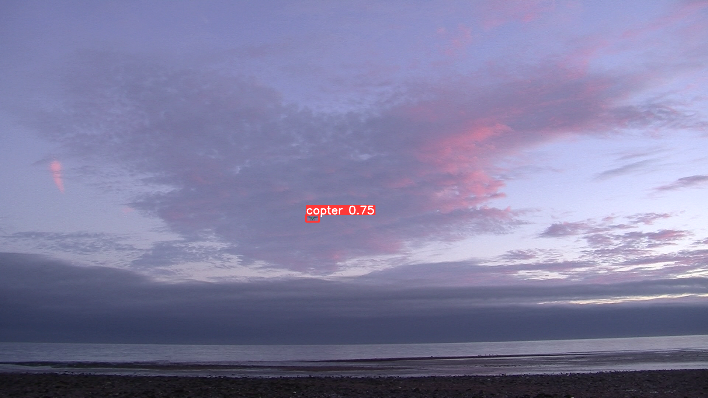

# Обнаружение летательных аппаратов нейросетью
#### Лидеры Цифровой Трансформации 2024



## Основные компоненты решения:

- **docker-compose.yml**
- **docker/** - разворачивание решения на сервере
- **web_app/** - веб-сервер + инференс
- **triton_repo/** - модели для Triton Inference Server (опционально)
- **train/** - инструкции по обучению модели (опционально)

## Используемые технологии:

- **Yolov8**
- **PyTorch**
- **Flask**
- **Triton**
- **OpenCV**
- **Docker**

## Развертывание решения:

1. Залить репозиторий вместе с моделью на сервер.
2. Выполнить команду:
    ```sh
    docker-compose up --build
    ```
3. Открыть в браузере:
    - [localhost:5000](http://localhost:5000) или
    - `http://ip_сервера:5000`